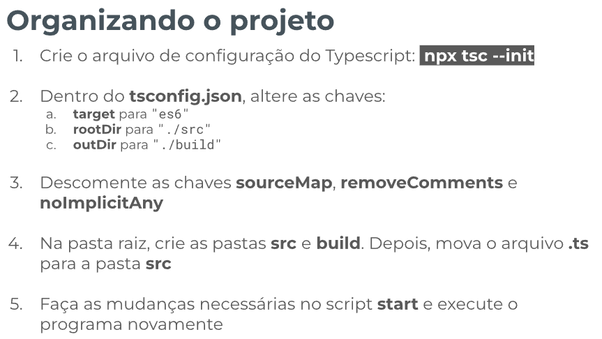

# Typescript - Template de Prática

## Índice

-   [1. Criando o projeto](#1-criando-o-projeto)
-   [2. Organizando o projeto](#2-organizando-o-projeto)
-   [3. Tipando](#3-tipando)
-   [4. Fixação](#4-fixação)

## 1. Criando o projeto

### Enunciado

## 2. Organizando o projeto

### Enunciado

## 3. Tipando

### Enunciado

## 4. Fixação

### Enunciado

